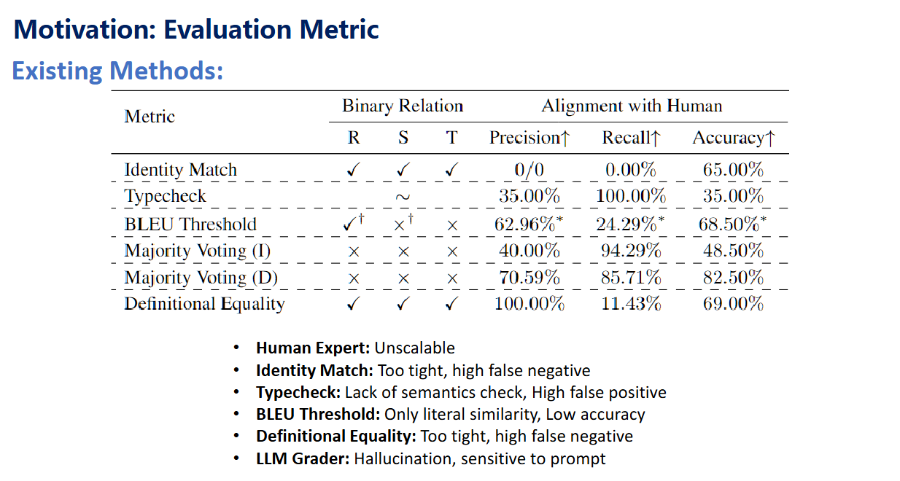
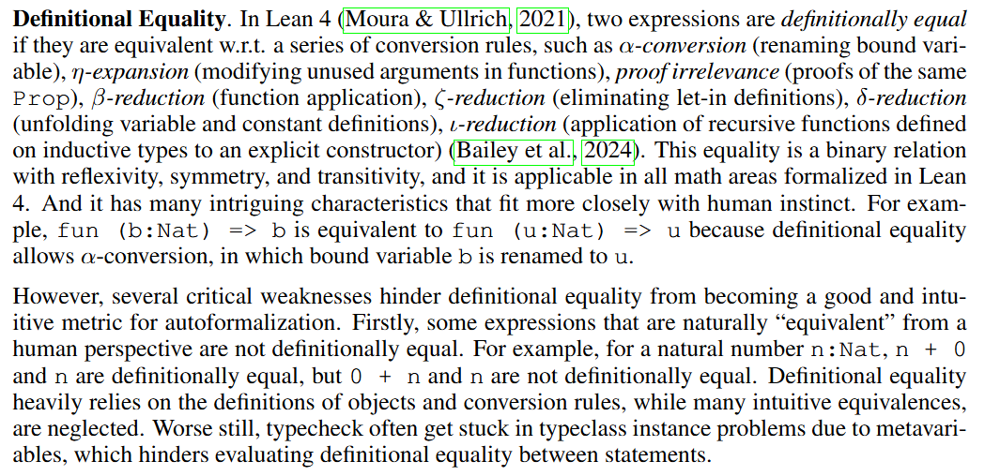
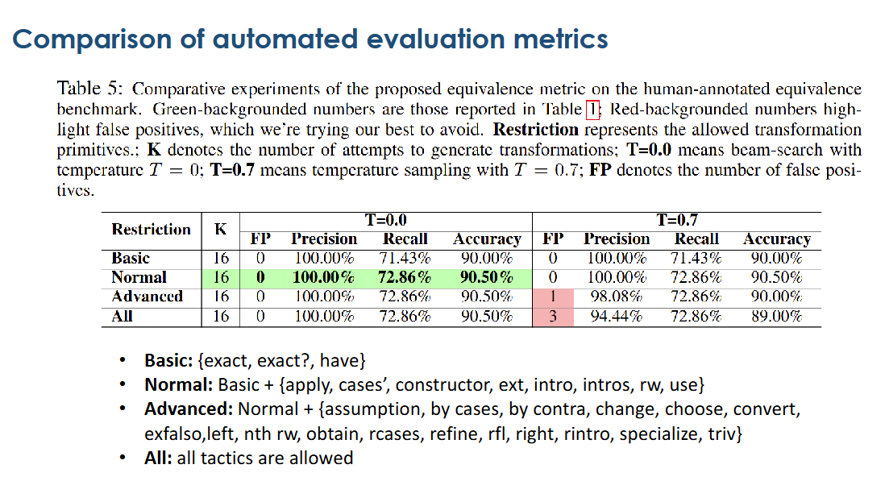
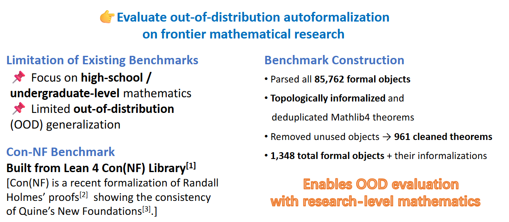

# Rethinking and Improving Autoformalization:Towards a Faithful Metric and a Dependency Retrieval-based Approach

paper：[Rethinking and Improving Autoformalization: Towards a Faithful Metric and a Dependency Retrieval-based Approach](https://openreview.net/pdf?id=hUb2At2DsQ 'Published as a conference paper at ICLR 2025')   

> Philosophy is written in this grand book, the universe.
It is written in the language of mathematics.

## Statement Autoformalization

### What do we need in statement autoformalization?
- BEq: 判断两个形式化表示是否等价
- RAutoformalizer: dependency retrieval + toplogical informalization 避免llm的hallucinate lemma
- Con-NF benchmark: 用于OOD evaluation

### Evaluation from natural expression to lean
Requirement: faithful, flexible, interpretable, semantic equivalence evaluation  
- faithful: 不能引入额外自由度，不要把具体对象变成参数。
- flexible
- interpretable
- semantic equivalence

### Bidirectional Extended Definitional Equivalence (BEq)

#### lean中的定义等价问题

| Issue | Description |
|------|-------------|
| Too strict | Misses many mathematically equivalent expressions (e.g. `0 + n` ≠ `n` definitionally). |
| Definition-dependent | Equivalence depends on how objects and functions are defined in the library. |
| No lemma reasoning | Cannot use rewrite rules or theorems; only computation-based equality. |
| Typeclass sensitivity | Typeclass inference and metavariables can block equality checking. |
| Poor for evaluation | Underestimates correctness in autoformalization tasks. |

#### What is the desired equivalence (·∼ ·) ?

- equivalence relation: rfl, symm, trans

intuition: can be quickly demostrated bidirectionally

#### 如何实现(my understanding)

**作者定义：**

它在形式化地定义一个函数 **(T)**：

> 给定目标陈述 ($s_P$)、已知陈述 ($s_Q$)、以及允许使用的一组变换原语（tactics）($R$)，如果能在这些限制下把 ($s_Q$) 变成一个和 ($s_P$) “定义等价”（definitional equality）的陈述 ($s'_P$)，就输出这个 ($s'_P$)；否则输出失败符号 ($\perp$)。 

简单来讲，如果我用$R$中的tactic，能从P推出Q，Q推出P，那么就说这两种定义等价。由于证明定义很简单，用大语言模型在lean内核上多次执行，在给定时间内能互推就行，否则定义不相等。 

> **思考**
>> SMT重写规则，bit-vector理论所有基础规则，和所有会用到的数学定义和数学定理全部形式化到一个library，再加上所有可用的tactic，将这些东西封装到上面的$R$中，我限制llm只能使用$R$中的东西来形式化QF_BV的一些题目,有用的消去规则就加入到$R$中，这样我不断去扩充我的$R$,并且我的llm每次证明成功都把`proof抽象出来的DAG/dependency graph`和`state-tactic`的拿出来学习，这对于这种封闭的数学理论体系，很有帮助，我不断去增强我的llm的形式化能力，从最开始随机搜索lemma和tactic乱猜+[expert iteration]，到最后数据量堆上来后llm能真正real understand如何求解。我希望我能做到在无干预下不断`刷题`然后自动形式化到`project level`，然后我尝试让llm基于`固定位宽的证明`生成`任意位宽的证明`，这些东西统统加入到smt中，有助于我们在下次smt_comp取得胜利。

| Stage | Core Idea | Method | Safety Guarantee | Outcome |
|------|-----------|--------|------------------|---------|
| Benchmark source | Use SMT benchmarks with known answers | QF_BV problems from SMT-COMP | Ground truth SAT/UNSAT available | Reliable training & evaluation tasks |
| Verification kernel | Lean as the only verifier | All proofs checked by Lean kernel | Logical soundness guaranteed | No false lemmas enter the system |
| Initial R | Minimal BV rewrite & tactics | Core BitVec defs + safe simp rules | Termination + soundness | Stable starting proof system |
| Proof generation | LLM + search under restricted R | Action DSL + Lean execution | LLM cannot use forbidden tactics | Controlled proof exploration |
| Expert iteration | Search teaches the LLM | State–tactic trajectories | Only successful Lean proofs recorded | Continual policy improvement |
| Proof mining | Extract proof structure | Dependency DAG + tactic traces | Data comes only from valid proofs | High-quality supervision |
| R expansion | Add frequently useful lemmas | Lean-proved lemmas from mining | Lean proof = logical safety | Stronger and richer R |
| Fixed bitwidth learning | Solve concrete BV problems | n = 8/16/32/64 proofs | Fully verified in Lean | Empirical discovery of patterns |
| Generalization | Lift to parametric theorems | Prove `∀ n : Nat, BitVec n` | Lean-verified universality | Bitwidth-independent rules |
| SMT integration | Export proven rules | Rewrite rules / tactics for SMT | Lean proof + side-condition checks | Stronger SMT solver |
| Long-term goal | Fully automatic bootstrapping | Unsupervised problem solving | Kernel-verified at every step | Project-level autoformalization |

### Comparison of automated evaluation metrics

> achieving an optimal balance between precision and recall under moderate proof constraints.  

## Retrieval-augmented autoformalization

**Reduce hallucinations in statement autoformalization**

- 形式化库发展迅速而llm pre trained slowly -> autoformalizer 缺乏库中的先验知识

**Solution**

- Dependency retrieval: 从库中为每个非正式语句选择潜在的依存形式化对象
- Rautoformalizer: 用检索到的依赖关系来增强自动形式化。
- Topological Informalization: 解析形式化库 → 按拓扑顺序非形式化 → 生成高质量的训练数据

### Dependency Retrieval

> dense retriever: nn transfering from statement to a vector(embedding)  

通过dense retriever找到top-k个予以相识的formal objects(via cosin similarity)

## Con-NF: OOD benchmark

## takeaway

-  Current LLM pre-training falls behind rapid progress in formal
mathematics
- (Neural)-Symbolic evaluation is faithful, interpretable, and hallucination-
free
- Retrieval-augmented generation helps alleviate hallucination

